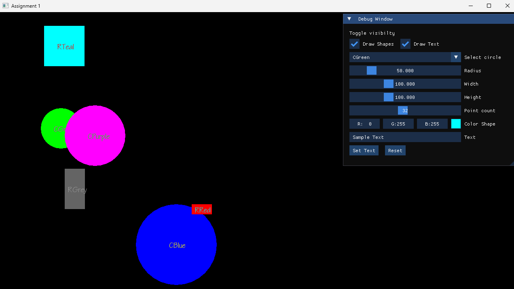

# Assignment1 of COMP 4300 by Dave Churchill

A 2D game project built with:

* C++23
* SFML 3
* Dear ImGui
* ImGui-SFML
* CMake
* GCC (MSYS2 UCRT64)

This project serves as a foundation for building 2D games using modern C++ and SFML.

---

# Features

* SFML 3 rendering and window management
* Dear ImGui integration for debugging tools and UI
* CMake-based build system
* Cross-machine reproducible setup
* Organized asset management
* Modern C++23 support

---

# Project Structure

```text
assignment1/
├── assets/
│   ├── config/
│   └── fonts/
│
├── build/
│
├── external/
│   ├── imgui/
│   └── imgui-sfml/
│
├── src/
│   └── game.cpp
│
├── CMakeLists.txt
├── README.md
└── .gitignore
```

---

# Prerequisites

## Windows

Install:

### MSYS2

Download and install:

https://www.msys2.org/

### GCC (UCRT64)

Open the MSYS2 UCRT64 terminal and install:

```bash
pacman -Syu
```

Restart the terminal if prompted, then run:

```bash
pacman -S mingw-w64-ucrt-x86_64-gcc
```

Verify:

```bash
g++ --version
```

---

### CMake

Download:

https://cmake.org/download/

Verify:

```bash
cmake --version
```

---

### SFML 3

Install through MSYS2:

```bash
pacman -S mingw-w64-ucrt-x86_64-sfml
```

Verify:

```bash
pacman -Q mingw-w64-ucrt-x86_64-sfml
```

---

# Cloning the Repository

Because this project uses Git submodules, clone using:

```bash
git clone --recurse-submodules <repository-url>
```

Example:

```bash
git clone --recurse-submodules https://github.com/your-username/assignment1.git
```

If you already cloned without submodules:

```bash
git submodule update --init --recursive
```

---

# Building the Project

Create a build directory:

```bash
mkdir build
cd build
```

Configure CMake:

```bash
cmake .. -G "MinGW Makefiles" -DCMAKE_PREFIX_PATH=C:/msys64/ucrt64
```

Build:

```bash
cmake --build .
```

or

```bash
mingw32-make
```

---

# Running

After a successful build:

```bash
Assignment1.exe
```

The executable will be generated inside:

```text
build/
```

---

# Development Setup

This project was developed using:

* Windows 10
* MSYS2 UCRT64
* GCC 16+
* SFML 3.0.2
* Dear ImGui 1.91.x
* ImGui-SFML 3.x
* CMake 4.x
* Sublime Text 4

---

# Updating Submodules

Update all submodules:

```bash
git submodule update --remote
```

Fetch the latest changes:

```bash
git submodule foreach git pull origin master
```

Commit the updated submodule references:

```bash
git add .
git commit -m "Update submodules"
git push
```

---

# Assets

Fonts, textures, audio files, and configuration files are stored under:

```text
assets/
```

Example:

```text
assets/
├── fonts/
├── textures/
├── audio/
└── config/
```

---

## Screenshot


---

# Troubleshooting

## SFML Not Found

Verify SFML is installed:

```bash
pacman -Q mingw-w64-ucrt-x86_64-sfml
```

If CMake cannot find SFML:

```bash
cmake .. -DCMAKE_PREFIX_PATH=C:/msys64/ucrt64
```

---

## Missing Submodules

Initialize submodules:

```bash
git submodule update --init --recursive
```

---

## Font Loading Errors

Ensure assets exist:

```text
assets/fonts/
```

and verify paths used in code are correct.

---
